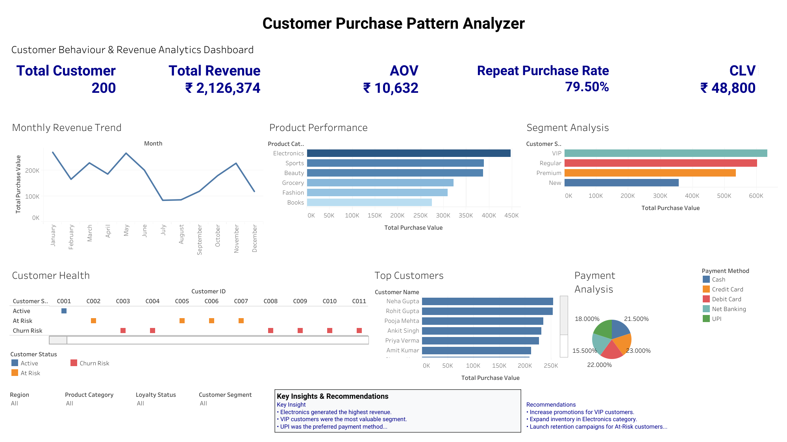

# Customer Purchase Pattern Analyzer

## Dashboard Overview

## Project Objective

Analyze customer purchase behavior to identify buying patterns, customer segments, revenue drivers, and retention opportunities.

## Tools Used

- Excel
- SQL
- Tableau / Power BI
- GitHub

## Key KPIs

- Total Revenue
- Total Customers
- Average Order Value (AOV)
- Customer Lifetime Value (CLV)
- Repeat Purchase Rate

## Key Insights

- VIP customers generated the highest revenue.
- Electronics was the top-performing category.
- North region generated the highest sales.
- UPI was the preferred payment method.

## Business Recommendations

- Expand loyalty programs.
- Improve customer retention campaigns.
- Promote high-performing product categories.
- Focus marketing efforts on underperforming regions.
